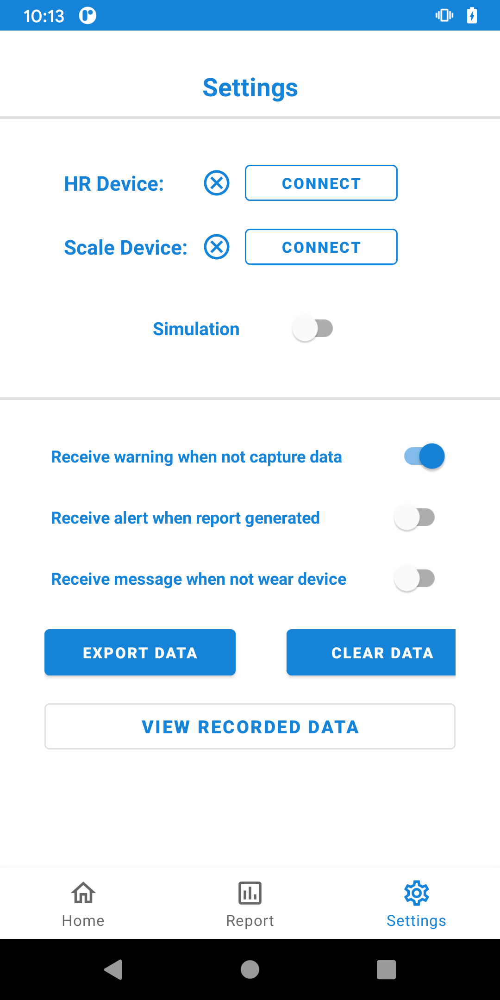
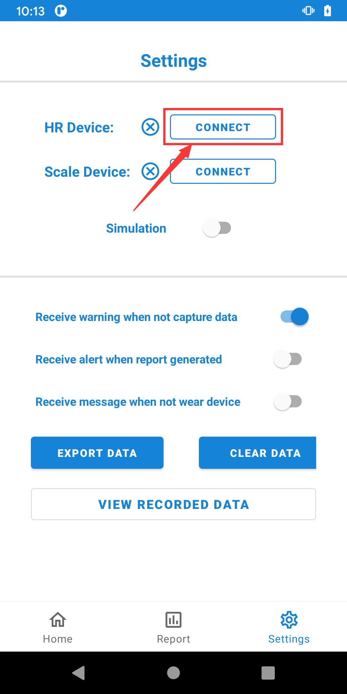

# User Manual

## Brief Introduction 

There are 3 pages:

1. Home page: you can see the real time data of ECG and hear rate in this page.

2. Report page: daily, weekly and monthly report of heart rate and weight will be displayed.

   

3. Setting page: devices connection, personal settings and data exporting function can be done in this page.

   

## Capture Heart Rate 

### 1. Wear the device

Wear your Polar heart rate device correctly, make sure it has enough power and be open.

[Polor device wear photo here]

### 2. Connect with device

After wearing the device, open the setting page and click "CONNECT" button for heart rate device

Then input device's ID which can be found in Polar device [photo here]

### 3. Start capture data

Back to home page, and open the "Start Capture Data" switch

Now the system could capture you heart rate data, and display it as a chart

### [optional] Record heart rate data

Click the "Start Recording Hr" button, the system will start recoding your heart rate data.

After you click "Stop Recording Hr" button, the system will export data that recorded as a ".csv" file in your mobile phone.

[Click here to see how to view the data that have exported](##View exported data)

## Measure Weight

### 1. Connect with device

Open the setting page and click "CONNECT" button for Scale device

Then the system will search and show connectible devices, choose the right one [photo here]

### 2. Stand at scale device

After connecting, you need to stand at scale device [photo here]

### 3. Measure data

[photo here]

## View Health report

## Export data

All of the heart rate data that the system captured will be stored temporarily in your mobile phone, you can export these data  if needed.

Click "EXPORT DATA" button in settings page.

## Clear data

If you want to clear all of data that have been captured, you can click "CLEAR DATA" button in settings page.

This operation will reset the database, which means all of data that include heart rate, weight and health report will be cleared.

## View exported data

Click this button in setting page

